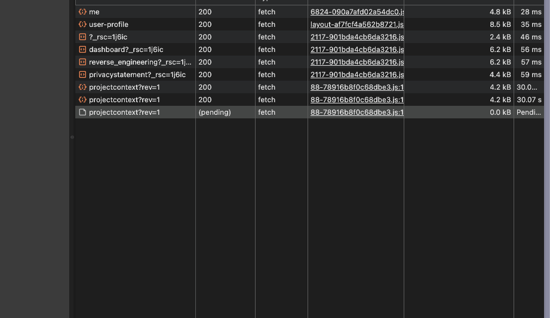

# Hypercritical Streaming Demo

A technical demonstration built for Hypercritical, showcasing streaming implementation for their AI code generation platform

## 🚀 Live Demo

**[View Live Demo →](https://your-demo-url.vercel.app)**

## 🔍 What I'm Mirroring

This demo replicates **Hypercritical's test script generation workflow**, specifically:

### Core Functionality

- **AI-powered code generation** for control systems (Python/MATLAB)
- **Test script management** with sidebar navigation
- **Monaco editor integration** for code viewing/editing

## 🚨 Demo highlights

### 1. Polling-Based Code Generation

**Issue:** The script generation uses polling implementation

- Users wait without real-time feedback
- Potential memory leaks from indefinite retry loops
- Unnecessary HTTP requests during polling intervals
- Poor responsiveness compared to modern AI interfaces

**Solution:** Streaming implementation provides real-time character-by-character generation

### 2. Performance & Rendering Issues

**Issue:** Rerendering inefficiencies throughout the dashboard

- Simple actions like "Edit" trigger full dashboard re-renders
- Could scale poorly for projects with thousands of tests
- Impacts user experience during interactions

**Solution:** Optimized state management with Jotai atoms and proper React patterns

### 3. Responsive Design Gaps

**Issue:** UI doesn't adapt well to different screen sizes

- Poor tablet experience
- Layout breaks on smaller screens
- Inconsistent spacing and component sizing

**Solution:** Responsive design with Tailwind's container queries and adaptive layouts
